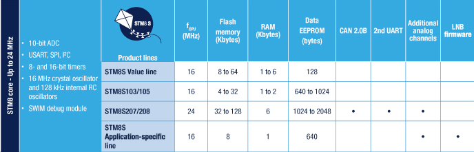

# [STM8S](https://github.com/sochub/STM8S)

 

#### 厂商：[ST](https://github.com/sochub/ST) 

#### 架构：[STM8](https://github.com/sochub/STM8)

## [描述](https://github.com/sochub/STM8S/wiki) 

STM8S通用系列，属于8位单片机但不是8051架构，采用ST的130nm工艺和内核架构，主频可达24MHz，处理能力约20MIPS。

 

### [收录资源](https://github.com/sochub/STM8S)

* [文档](docs/)
* [资源](src/)
    * [SDCC资源](src/SDCC)
* [工程](project/)

### [收录型号](https://github.com/sochub/STM8S)

* [STM8S00](https://github.com/sochub/STM8S00) 
* [STM8S10](https://github.com/sochub/STM8S10) 
* [STM8S20](https://github.com/sochub/STM8S20) 
* [STM8S90](https://github.com/sochub/STM8S90) 

### [选型建议](https://github.com/sochub/STM8S)

STM8S系列单片机是STM8中通用型，拥有大量可选型号，资源非常丰富多样，市场广泛使用，可以用于替换原来8051处理器，或者是STM32处理器。

##  [SoC资源平台](http://www.qitas.cn)  
