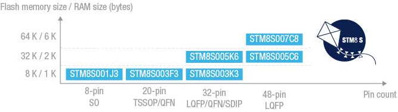

# [STM8S](https://github.com/sochub/STM8S)
 
####  qitas@qitas.cn
#### 父级：[STM8](https://github.com/sochub/STM8) 
#### 近似：[MCS-51](https://github.com/sochub/MCS-51)

## [描述](https://github.com/sochub/STM8S/wiki) 

STM8单片机通用系列，8位单片机但不是8051架构，采用ST的130nm工艺和内核架构，主频达24MHz，处理能力达20MIPS

 
 

## [组成](https://github.com/sochub/STM8S)

- [文档](docs/)
- [资源](src/)
- [工程](project/)

### [收录型号](https://github.com/sochub/STM8S)

- [STM8S00](https://github.com/sochub/STM8S00) 
- [STM8S10](https://github.com/sochub/STM8S10) 
- [STM8S20](https://github.com/sochub/STM8S20) 
- [STM8S90](https://github.com/sochub/STM8S90) 

##  [SoC开发平台](http://www.qitas.cn)  

