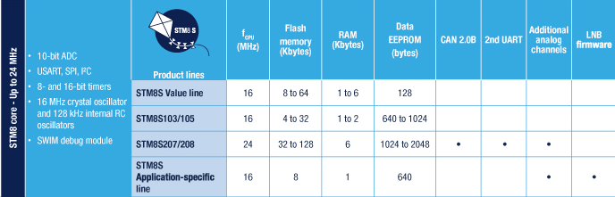

# [STM8S](https://github.com/sochub/STM8S)

 
#### [Vendor](https://github.com/sochub/Vendor)：[ST](https://github.com/sochub/ST)
#### [STM8](https://github.com/sochub/STM8)：[STM8](https://github.com/sochub)
#### [Level](https://github.com/sochub/Level)：16MHz 

## [STM8S简介](https://github.com/sochub/STM8S/wiki) 

STM8S通用系列，属于8位单片机但不是8051架构，采用ST的130nm工艺和内核架构，主频可达24MHz，处理能力约20MIPS。

 

### [收录资源](https://github.com/sochub/STM8S)

* [文档](docs/)
* [资源](src/)

### [关联资源](https://github.com/sochub)

* [SDCC](https://github.com/sochub/sdcc)
* [Platform H02](https://github.com/OS-Q/H02)

### [收录子类](https://github.com/sochub)

* [STM8S003](https://github.com/sochub/STM8S003) 
* [STM8S103](https://github.com/sochub/STM8S103) 
* [STM8S105](https://github.com/sochub/STM8S105) 
* [STM8S207](https://github.com/sochub/STM8S207) 
* [STM8S903](https://github.com/sochub/STM8S903) 

### [选型建议](https://github.com/sochub)

STM8S系列单片机是STM8中通用型，拥有大量可选型号，资源非常丰富多样，市场广泛使用，可以用于替换原来8051处理器，或者是STM32处理器。

##  [SoC资源平台](http://www.qitas.cn)  
