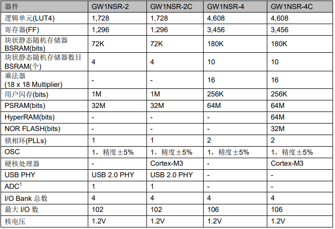

# [GW1NSR-LV4C](https://github.com/SoCXin/GW1NSR-LV4C)

* [Gowin](http://www.gowinsemi.com.cn/)：[FPGA + Cortex-M3](https://github.com/SoCXin/Cortex-M3)
* [L3R4](https://github.com/SoCXin/Level)：80 MHz

## [简介](https://github.com/SoCXin/GW1NSR-LV4C/wiki)

高云半导体GW1N系列产品是高云半导体小蜜蜂®(LittleBee®)家族第一代产品，具有低功耗、瞬时启动、低成本、非易失性、高安全性、封装类型丰富、使用方便灵活等特点。

高云半导体 GW1N 系列 FPGA 产品(车规级)是高云半导体小蜜蜂®(LittleBee®)家族第一代产品，具有较丰富的逻辑资源，支持多种 I/O 电平标准，内嵌块状静态随机存储器、数 字信号处理模块、锁相环资源，此外，内嵌 Flash 资源，是一款具有非易失性的 FPGA 产品，具有低功耗、瞬时启动、低成本、高安全性 、产品尺寸小、封装类型丰富、使用方便灵活等特点。

高云半导体 GW1NR系列产品是一款系统级封装芯片，在 GW1N 基础上集成 了丰富容量的 SDRAM 存储芯片，同时具有低功耗、瞬时启动、低成本、非易失性、高安全性、封装类型丰富、使用方便灵活等特点。

[GW1NSR-LV4C](https://github.com/SoCXin/GW1NSR-LV4C) 内嵌 ARM Cortex-M3硬核处理器。

### 关键特性

* ARM Cortex-M3硬核处理器
* 4608 4输入LUT4单元
* 180Kbit SRAM
* 12bit SAR ADC (1MSPS)
* USB2.0 PHY（480Mbps）

### [资源收录](https://github.com/SoCXin)

* [参考资源](src/)
* [参考文档](docs/)
* [参考工程](project/)
* [入门文档](https://docs.soc.xin/GW1NSR-LV4C)

### [选型建议](https://github.com/SoCXin)

[GW1NSR-LV4C](https://github.com/SoCXin/GW1NSR-LV4C)

### [探索芯世界 www.SoC.xin](http://www.SoC.Xin)
